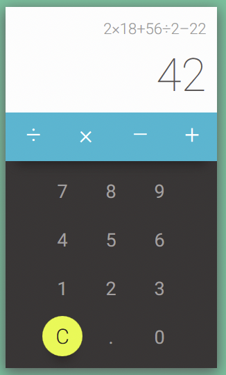
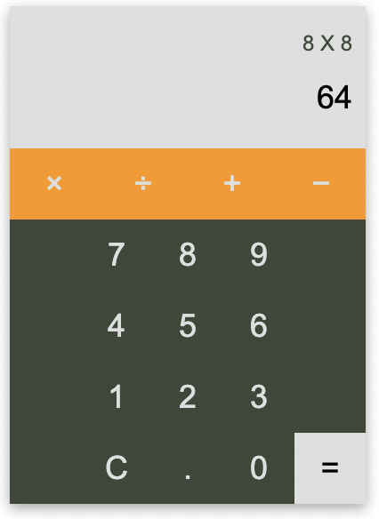

# JavaScript-Calculator

## Table of Contents

-   Project Descriptiom
-   Inspiration and Chosen Styling
-   Coding Stack
-   Approach
-   Challenges
-   Additions

## Project description

### Outline

-   Create a README.md on your Calculator repository that includes a picture of the design you will be reproducing
-   Using HTML + SCSS, recreate the design that you chose
-   In the README.md add a breakdown of your project for the JavaScript part of the code. We encourage you to be as granular as possible. const scope3 = () => { const scope3Var = "123"; }

### MVP

1. Create a calculator to be rendered to the html page
2. it should have number keys from 0 to 9const scope3 = () => { const scope3Var = "123"; }
3. It should have operator keys (+, -, /, \*, =)
4. It should have a display rendering the current calculation in a box at the top
5. It should also have a “.” key

## Inspiration/Styling

<figure>
<figcaption>Inspiration Image</figcaption>

</figure>

<figure>
<figcaption>Live Design</figcaption>

</figure>

## coding Stack

-   Javascript
-   HTML
-   CSS/SCSS/SASS

## Setup

To access the live demo please click here:

🔗 [Live Demo](https://darcyjhenschke.github.io/JavaScript-Calculator/)

## Approach

The follwoing explains the way I approached this project:

Firstly, using only HTML and SCSS, build the UI for the calculator.

For the calculator I created I planned to have two displays on it. One of these displays would render the string of numbers and operators (equation to be calculated) and another would render the computed result after the equals operand was clicked. This allowed me to break the project down into two seperate parts. These parts were:

-   The functions and dom manipulation which would render the innertext of each button to the input display give special operands (clear, decimal and equals) their functionality.
-   A fucntion which could take this input display equation and compute it without using eval()

The first part listed above was acheived by giving each button an onClick event listener and then concatinating the input innerText as equal to the innertext of the button clicked. This allowed a desired equation to be parsed into the input display live as a user interacts with the buttons.

The buttons with special functionality were handled by giving each of these blocks and if statement with the return being their desired functionality

For example the following if statement was given to the clear button

```
if (button.innerText === "C") {
    return input.innerText = "";
}
```

once all buttons besides the equals buttons was given functionality, I then undertook the second actionable task I identified. Which was creating a function that could take in a string of numbers and operators and compute it.

The way this function worked was by:

-   Spliting the string into an array of characters.
-   Then by using a for loop with a nested if else statement the operators and numbers were seperated into two seperate arrays.
-   The two arrays were then iterated over through a switch statement that had a case for each operator.
-   This switch statement returned a number which was the result of the inputted eqaution.

Finally to complete the main functionality of this task I gave the equals button its functionality. When equals was clicked the function explained above was called with the input.innerText as the parameter. The result display.innerText was than set as equal to the outcome of this function.

## Challenges

-   The main challenge I had to overcome was the logic required to deal with multiple decimals. I struggled with this because I could not think of a way to approach this and I didn't want to interfere with any of my other logic as every other part of the calculator was fully functional. I overcame this by taking a step back from my code. I realsied all I needed was a simple counter that incremented when the decimal button was pressed and reset to zero when any operator was clicked. The an if statement could be written on the value of this counter which would allow/not allow another decimal to be concatenated to the input display.

## Additions

-   Restrict length of input equation, ensure last character clicked is a number not an operator.
-   Add more operators and functionality to calculator (square root, powers, order of operations).
-   after an equation is calculated set the input display to the answer when a user chains on another equation to that which has already been calculated.
-   Provide better styling feedback when buttons are clicked (hover, active).
